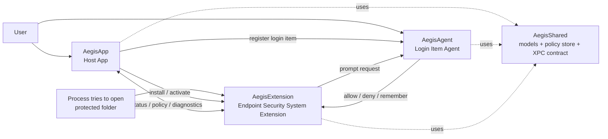

# Aegis

Aegis 是一个面向 macOS 14.5+ 的原生安全产品原型，目标是用 Apple 官方的 Endpoint Security 能力保护用户选定的本地目录：当某个进程试图访问这些目录时，Aegis 在本机拦截 AUTH_OPEN 事件，基于本地策略、受信进程规则和用户确认结果决定放行还是拒绝。

这个仓库不是单纯的概念规划。它已经具备 Host App、Login Item Agent、System Extension、共享模型、XPC 通信、测试脚本和发布脚本的完整工程骨架，并且把发布前必须面对的 Apple 平台约束显式沉淀到了文档里。

## 项目主要解决什么问题

macOS 原生权限模型可以限制很多系统级行为，但对于“某些特定目录只能在用户确认后被访问”这类场景，常规沙箱或 Finder 权限并不能直接提供细粒度控制。Aegis 解决的是下面这类需求：

- 保护特定工作目录，而不是泛化成整机管控
- 对未知进程的访问进行实时确认，而不是静态白名单一次性放开
- 所有决策都在本地完成，不依赖云端策略服务
- 在 Apple 官方边界内实现，而不是依赖内核扩展或第三方驱动

目前的策略模型已经覆盖：受保护目录、本地默认回退策略、remembered decisions、受信进程判定，以及 Agent 不可达或用户超时时的本地兜底行为。

## 为什么必须用 Apple 原生技术

Aegis 的核心判断发生在文件访问授权阶段，这决定了它必须建立在 Apple 官方的安全框架之上，而不能只靠普通前台应用逻辑实现。仓库当前采用的方向是：

- 用 System Extension 承载真正的安全能力，而不是旧式内核扩展
- 用 Endpoint Security 订阅 AUTH_OPEN 授权事件，而不是事后审计
- 用 Login Item Agent 在登录会话里展示原生确认窗口，保证交互发生在正确用户上下文
- 用 NSXPCConnection 和共享容器连接 App、Agent、Extension 三端，而不是引入外部运行时

这也意味着项目天然受 Apple 签名、公证、entitlement 审批、Full Disk Access 和用户批准流程约束。相关现实限制已经整理在 [docs/system-extension-requirements.md](docs/system-extension-requirements.md)。

## Apple 技术栈

仓库当前明确使用了这些 Apple 技术和系统能力：

| 技术 | 在 Aegis 中的作用 |
| --- | --- |
| SwiftUI | Host App、Onboarding、Dashboard、Settings、Agent Prompt Center 的原生 UI |
| Observation | AppRuntime 和 AgentRuntime 的状态驱动 |
| Endpoint Security | 拦截 AUTH_OPEN 并做实时 allow/deny 决策 |
| System Extensions | 以 .systemextension 形式部署安全组件 |
| OSSystemExtensionRequest | 由宿主 App 触发扩展安装与激活 |
| ServiceManagement / SMAppService | 管理登录项形式的 AegisAgent |
| NSXPCConnection / Mach XPC | App、Agent、Extension 三端通信 |
| App Groups / Shared Container | 共享本地策略、状态和 IPC 落盘数据 |
| OSLog / unified logging | 诊断事件与运行状态记录 |
| XCTest / xcodebuild | 单元测试、UI 测试、发布校验测试 |
| codesign / notarytool / stapler / spctl | 签名、公证、验证和发布链路 |

## 架构概览

Aegis 采用典型的三端分层架构：前台宿主 App 负责安装、状态展示和配置；登录项 Agent 负责用户确认；System Extension 负责真正的授权判定；Shared 模块负责统一业务真相。



### 模块职责

| 模块 | 责任 |
| --- | --- |
| AegisApp | Onboarding、System Extension 激活、登录项管理、状态总览、受保护目录配置、诊断信息展示 |
| AegisAgent | 接收访问确认请求，展示允许/拒绝交互，并可选择记住这次决策 |
| AegisExtension | 订阅 AUTH_OPEN、命中 trusted process 或 remembered decision、超时回退、向 Agent 发起 prompt |
| AegisShared | 共享模型、NSSecureCoding/XPC 合约、本地策略持久化、状态快照、路径与策略默认值 |

### 决策链路

1. 某个进程尝试访问受保护目录。
2. AegisExtension 收到 AUTH_OPEN 授权事件。
3. 决策引擎先检查本地策略、受信进程规则和 remembered decisions。
4. 如果无法直接判定，则通过 XPC 把 prompt 请求发给 AegisAgent。
5. 用户在 Agent 窗口里选择 Allow 或 Deny，并可决定是否记住这次决策。
6. Extension 在截止时间内返回授权结果；若 Agent 不可达或用户超时，则按本地默认策略回退。

## 当前状态

按 [plan/state.yaml](plan/state.yaml) 记录，项目已经完成 Phase 0 到 Phase 6：

- 工程骨架、Shared Domain、Onboarding、Agent/XPC、Extension 决策引擎、Settings 与本地配置都已落地
- 发布链路已收敛到 AegisApp.app 与 ZIP 产物，并具备签名、公证、验证脚本骨架
- 测试入口已经统一到 [scripts/test.sh](scripts/test.sh) 和 ReleaseValidationTests

当前尚未闭环的是 Phase 7：真实特权 smoke 与最终发布准备。阻塞点主要不在 Swift 代码本身，而在 Apple 侧分发前提：

- Endpoint Security entitlement 审批
- Developer ID 签名与 provisioning profile
- 用户批准 System Extension 与 Full Disk Access 的真实验证

这部分现状、风险和缺口，见 [docs/system-extension-requirements.md](docs/system-extension-requirements.md) 与 [docs/release/readiness-checklist.md](docs/release/readiness-checklist.md)。

## 本地开发与验证

### 基本前提

- macOS 14.5+
- 可用的 Xcode 命令行构建环境
- 如果要验证真实 System Extension 装载链路，需要满足 Apple 开发者签名条件，或在 Developer Mode 下调试

### 常用命令

```sh
./scripts/test.sh
```

```sh
./scripts/validate-release.sh
```

如果你关心的是真实装载、批准与 Endpoint Security 订阅链路，而不是单纯构建测试，请先读 [docs/system-extension-requirements.md](docs/system-extension-requirements.md)。

## 仓库结构

```text
AegisApp/        Host App：onboarding、dashboard、settings、安装与状态
AegisAgent/      Login Item Agent：用户确认交互
AegisExtension/  Endpoint Security System Extension：实时授权判定
AegisShared/     共享模型、XPC 协议、持久化与公共工具
Tests/           App / Agent / Extension / ReleaseValidation 测试
docs/            架构、术语、系统要求、发布与 smoke 文档
plan/            phase 规划、执行包、状态与 handoff
scripts/         构建、签名、公证、打包、测试、发布验证脚本
```

## 文档导航

README 只保留总览。更细的设计、发布和执行信息请直接进入对应文档：

- 项目规划入口：[Plan.md](Plan.md)
- 术语与模块定义：[docs/terminology.md](docs/terminology.md)
- Phase 顺序与架构因果：[docs/architecture-causality.md](docs/architecture-causality.md)
- System Extension 真实约束与现状评审：[docs/system-extension-requirements.md](docs/system-extension-requirements.md)
- 发布 runbook：[docs/release/runbook.md](docs/release/runbook.md)
- 发布前检查：[docs/release/readiness-checklist.md](docs/release/readiness-checklist.md)
- 特权 smoke 清单：[docs/release/privileged-smoke-checklist.md](docs/release/privileged-smoke-checklist.md)
- 执行流与 phase 清单：[plan/manifest.yaml](plan/manifest.yaml)

## 未来如何发展

结合当前代码、phase 状态和平台约束，Aegis 最现实的下一步发展路径是：

1. 完成 Phase 7：把真实机器上的 System Extension 批准、FDA、privileged smoke 和 release 留痕跑通。
2. 补齐 Apple 分发链路：落地 Developer ID、profile、notarization 与最终可安装工件验证。
3. 打磨首次使用体验：把“需要用户批准”“需要 FDA”“为什么当前不可用”从原始系统错误提升为明确的产品引导。
4. 继续增强本地策略模型：围绕 trusted process、remembered decisions、诊断与回退策略做更稳健的产品化收敛。

如果你想看这条路线是如何被拆成可执行阶段的，直接从 [plan/phases](plan/phases) 和 [plan/execution](plan/execution) 开始。
