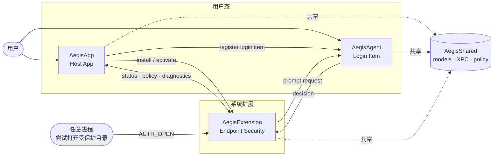

<div align="center">

# Aegis

**macOS 原生的目录级访问仲裁器。** 在 Apple 官方授权路径上，把"谁可以打开哪个目录"这个问题从用户的警觉心，交还给操作系统本身。

> _"在文件真正被打开的那一刻问你一声，而不是等它已经被读完。"_

[](docs/system-extension-requirements.md)
[](plan/common.md)
[](plan/common.md)
[](plan/common.md)
[](LICENSE)

</div>

---

## Why

macOS 的默认安全模型擅长回答「这个进程能不能做系统级操作」，但不擅长回答「这个进程**此刻**能不能打开**这几个目录**」。常规沙箱、Finder 权限、FDA 都是**粗粒度 + 一次性授权**，一旦放行就不再追问；而真正危险的数据泄漏、勒索加密、静默读取，往往就发生在「已经授权过的进程」的下一次打开动作里。

Aegis 要封堵的正是这一缝隙：**在文件即将被打开的那一瞬间**做一次本地、细粒度、可回撤的仲裁。

## Core idea

一句话：**把目录保护下沉到操作系统的授权路径里，而不是浮在应用层。**

四条底层主张：

- **拦截必须发生在 AUTH_OPEN，而不是事后审计。** 只有 Endpoint Security 的 AUTH 事件才能真正阻止访问；任何基于 FSEvents、kqueue 或文件快照比对的方案，都是「目录已经被读完之后的叹气」。
- **决策必须留在用户本机。** 没有云策略、没有账号体系、没有遥测。用户数据的归属权和裁决权在同一台机器上，不外泄、不下发。
- **UI 必须发生在正确的用户会话里。** 弹窗不能来自 System Extension（没有用户上下文），也不能来自后台守护进程（无法原生呈现）——必须由登录态的 Login Item Agent 负责，并以 Apple 原生视觉呈现。
- **实现必须全部落在 Apple 官方边界内。** 不写 KEXT、不绕签名、不引入第三方 SDK。这既是产品可分发性的前提，也是长期可维护性的前提。

推论：Aegis 的架构不是"选型"出来的，而是上面四条约束**唯一允许**的形态。

## How it works

三端分层，职责正交；没有任何一端可以独立完成决策。

| 层 | 运行位置 | 负责的问题 |
| --- | --- | --- |
| **AegisApp**<br>Host App | 用户前台 | 安装与激活 System Extension、注册 Login Item、展示状态与受保护目录配置 |
| **AegisAgent**<br>Login Item Agent | 用户登录会话 | 接收 prompt 请求、用原生窗口向用户确认、回传 allow / deny / remember |
| **AegisExtension**<br>Endpoint Security System Extension | 系统扩展进程 | 订阅 `AUTH_OPEN`、基于本地策略即时裁决、必要时向 Agent 发起 prompt 并在截止时间内回执 |
| **AegisShared**<br>共享契约层 | 被三端共用 | NSSecureCoding / XPC 协议、路径规则、策略存储、状态快照——**业务真相的唯一副本** |

三端的通信与持久化全部走 Apple 原生通道（NSXPCConnection、Mach services、App Groups），不引入任何外部运行时。

## Architecture



## Decision flow

一次受保护目录访问的完整生命周期：

1. 进程对受保护路径触发 `open()` 族系调用。
2. AegisExtension 在 AUTH 阶段收到 Endpoint Security 事件。
3. 决策引擎按顺序查询：**受信进程白名单 → remembered decision → 本地默认策略**；命中则直接回执。
4. 未命中则通过 XPC 向 AegisAgent 发出 prompt 请求。
5. Agent 在用户登录会话里弹出原生确认窗口，用户选择 Allow / Deny，并可选「记住此次决定」。
6. Extension 在 ES 截止时间内返回授权结果；Agent 不可达或用户超时时，按本地兜底策略回退。

关键：**决策永远在 ES 的截止时间内闭环**。超时不是 bug，是契约的一部分。

## Design principles

- **原生 · 原生 · 原生。** UI 遵循 Apple HIG，代码只用 Apple 官方框架，分发只走 Apple 签名 / 公证链路。
- **零第三方依赖。** 不引入 CocoaPods、Carthage、SwiftPM 外部包、XcodeGen——整个项目只依赖 Xcode 与系统 SDK。
- **完全本地化。** 没有云端、没有账号、没有遥测、没有崩溃上传。
- **业务真相单写。** 策略、路径、决策结构只在 AegisShared 里定义一次，三端引用而不重实现。
- **TDD 不是阶段性动作。** 从 phase-0 起就把签名、公证、发布校验与单元 / UI / Release 测试纳入同一条脚本入口。
- **国际化是一等公民。** 中 / 英 / 日从第一天起通过 `.xcstrings` 统一维护。

完整硬约束清单见 [plan/common.md](plan/common.md)。

## Non-goals

下面这些**明确不做**，以保持产品边界锐利：

- 云端策略分发、账号体系、远程审计
- 长期白名单托管、跨机同步
- WebView / H5 审批界面、第三方 UI 组件库
- 内核扩展（KEXT）或任何绕过 System Extensions 的路径
- macOS 14.5 以下版本兼容
- 遥测、埋点、自动崩溃上传

## Status

按 [plan/state.yaml](plan/state.yaml)，Phase 0–6 已完成，覆盖工程骨架、共享域、Onboarding、Agent/XPC、决策引擎、设置页与发布链路脚本。

尚未闭环的是 **Phase 7：真实特权 smoke 与最终发布准备**——阻塞点不在 Swift 代码本身，而在 Apple 平台侧前提：

- Endpoint Security entitlement 审批
- Developer ID 签名与 provisioning profile
- System Extension 批准与 Full Disk Access 的真实验证

详见 [docs/system-extension-requirements.md](docs/system-extension-requirements.md) 与 [docs/release/readiness-checklist.md](docs/release/readiness-checklist.md)。

## Repository layout

```text
AegisApp/        Host App：安装、状态、受保护目录配置
AegisAgent/      Login Item Agent：原生确认弹窗
AegisExtension/  Endpoint Security System Extension：AUTH_OPEN 决策
AegisShared/     三端共享的模型、XPC 协议与策略存储
Tests/           单元 / UI / ReleaseValidation 测试
docs/            架构、术语、系统要求、发布文档
plan/            Phase 合同、执行包、state 与 handoff
scripts/         构建、签名、公证、打包、测试、发布校验
```

## Quick start

本地开发与测试只依赖系统 Xcode 工具链：

```sh
./scripts/hooks/install.sh     # 首次 clone 后运行一次：激活仓库自带 git hooks（提交身份校验）
./scripts/test.sh              # 单元 + UI + release 校验测试
./scripts/validate-release.sh  # 发布前产物与签名校验
```

真实装载 System Extension、验证 AUTH_OPEN 订阅链路，需要满足 Apple 开发者签名条件，或在 Developer Mode 下调试——请先读 [docs/system-extension-requirements.md](docs/system-extension-requirements.md)。

## Roadmap

下一步演进优先级：

1. **跑通 Phase 7**——在真实机器上完成 System Extension 批准、FDA、privileged smoke 与 release 留痕。
2. **补齐 Apple 分发链路**——落地 Developer ID、profile、notarization，交付可直接安装的最终工件。
3. **首次使用体验**——把「需要批准」「需要 FDA」「为什么现在不可用」从原始系统错误提升为产品级引导。
4. **本地策略模型进化**——trusted process、remembered decisions、诊断与回退策略的产品化收敛。

## Documentation map

- [Plan.md](Plan.md) — 规划入口
- [docs/terminology.md](docs/terminology.md) — 术语与模块定义
- [docs/architecture-causality.md](docs/architecture-causality.md) — Phase 顺序的因果解释
- [docs/system-extension-requirements.md](docs/system-extension-requirements.md) — Apple 侧真实约束与现状评审
- [docs/release/runbook.md](docs/release/runbook.md) — 发布 runbook
- [docs/release/readiness-checklist.md](docs/release/readiness-checklist.md) — 发布前检查
- [docs/release/privileged-smoke-checklist.md](docs/release/privileged-smoke-checklist.md) — 特权 smoke 清单
- [plan/manifest.yaml](plan/manifest.yaml) — Phase 顺序与依赖
- [plan/common.md](plan/common.md) — 全局硬约束

## License

本项目采用 [MIT License](LICENSE)。允许商用、修改、再发布、私有使用，只要求在副本中保留版权与许可声明。软件按「原样」提供，不承担任何担保与连带责任。
