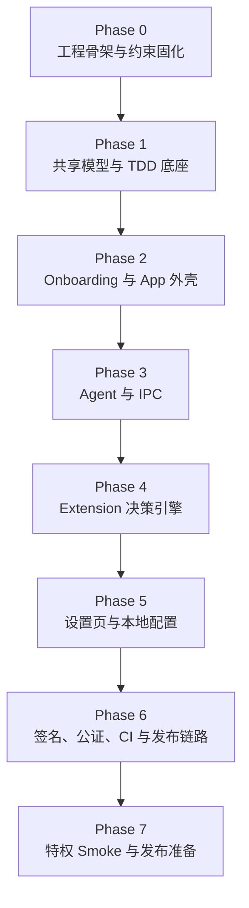

# Aegis 架构因果链

本文档专门解释 Aegis 的 phase 顺序为什么不能打乱，以及每个阶段与前后阶段之间的因果关系。

如果你想查单个术语或概念定义，请同时阅读 [terminology.md](terminology.md)。

## Phase 因果链

下面这条因果链描述了为什么各 phase 必须按当前顺序推进，而不能任意交换顺序。

## 因果解释

1. Phase 0 先固化原生工程、模块分层和零第三方依赖边界，否则后续所有实现都会缺少稳定载体。
2. Phase 1 先沉淀共享模型、路径规则和策略存储，否则 App、Agent、Extension 会各自维护不一致的业务真相。
3. Phase 2 先把宿主 App 的 onboarding 和 readiness 外壳搭起来，否则产品没有可进入、可解释、可展示的前台入口。
4. Phase 3 打通 Agent 与 IPC，否则 Extension 后续即使拦截到事件，也没有可靠的用户交互链路。
5. Phase 4 才能落地真正的 AUTH_OPEN 决策引擎，因为它依赖前面的共享模型、IPC 和 Agent 提示能力。
6. Phase 5 把既有能力暴露为用户可操作的设置页和本地配置，否则产品仍然只能依赖内部默认值运行。
7. Phase 6 把已有成果接到脚本化、可审计的发布流水线，否则无法稳定产出可签名、公证和验证的 release 工件。
8. Phase 7 最后在本地完整测试环境中做真实特权 smoke，因为它必须建立在可分发产物、可复用 runbook 和自动化发布链路已经具备的前提上。

## 三条主线如何衔接

### 产品主线

1. 先有共享模型和路径规则。
2. 再有用户前台入口和交互链路。
3. 最后才有真正的访问拦截和策略执行。

### 配置主线

1. 先定义默认策略和 remembered decision 结构。
2. 再打通 App、Agent、Extension 对同一策略的共同理解。
3. 再把它们暴露为设置页中的用户可编辑能力。

### 发布主线

1. 先产出稳定可构建的产品和测试基线。
2. 再把构建、签名、公证、打包、验证固化为自动化流程。
3. 最后在本地完整测试环境中做 privileged smoke，给 release 最终结论。

## 快速阅读建议

- 想理解术语定义，回到 [terminology.md](terminology.md)。
- 想理解为什么 phase-7 必须最后做，重点看 Phase 6 到 Phase 7 的衔接说明。
- 想理解产品、配置、发布三条线如何会合，先看“三条主线如何衔接”。
